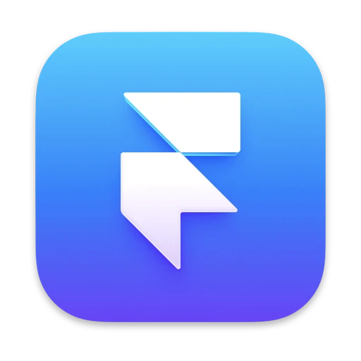

Hey there 👋

I'm an Full Stack Developer with a passion for AI & ML integration, I'm currently in my third year, pursuing a BE in Artificial Intelligence & Machine Learning at Adichunchanagiri Institute of Technology. I approach problem-solving with creativity and enthusiasm.

Want to know more about me? [Check out my portfolio.](https://amk.great-site.net/)

 

## 📌 Fav Repositories

 

 
 

<!-- ## 👋 Contributions

 -->

## 💼 Skills

<!-- Markup Languages -->
<table>
  <tr>
    <td align="center">
      
      
HTML 5

    </td>
    <td align="center">
      
      
JSX

    </td>
    <td align="center">
      
      
TSX

    </td>
    <td align="center">
      
      
XML

    </td>
  </tr>
</table>

<!-- Style Sheet Languages -->
<table>
  <tr>
    <td align="center">
      
      
CSS 3

    </td>
    <td align="center">
      
      
Sass

    </td>
    <td align="center">
      
      
Framer

    </td>
    <td align="center">
      
      
Bootstrap 5

    </td>
    <td align="center">
      
      
Tailwind

    </td>
  </tr>
</table>

<!-- JavaScript Frameworks -->
<table>
  <tr>
    <td align="center">
      
      
JavaScript

    </td>  
    <td align="center">
      
      
NodeJS

    </td>
    <td align="center">
      
      
ReactJS

    </td>
    <td align="center">
      
      
React Router

    </td>
    <td align="center">
      
      
Redux

    </td>
    <td align="center">
      
      
NextJS

    </td>
  </tr>
</table>

<!-- TypeScript -->
<table>
  <tr>
    <td align="center">
      
      
TypeScript

    </td>
    <!--  -->
  </tr>
</table>

<!-- Python -->
<table>
  <tr>
    <td align="center">
      
      
Python

    </td>
    <td align="center">
      
      
Flask

    </td>
    <td align="center">
      
      
Rasa

    </td>
  </tr>
</table>

<!-- Database -->
<table>
  <tr>
    <td align="center">
      
      
MySql

    </td>
    <td align="center">
      
      
MongoDB

    </td>
  </tr>
</table>

## 🍕 Social

<table>
  <tr>
    <td align="center">
      
        
LinkedIn

    </td>
    <td align="center">
      
        
Discord

    </td>
    <td align="center">
      
        
Leetcode

    </td>
    <td align="center">
      
        
Instagram

    </td>
  </tr>
</table>
