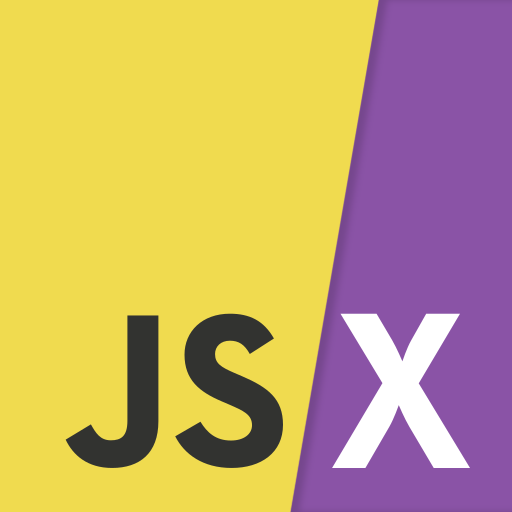
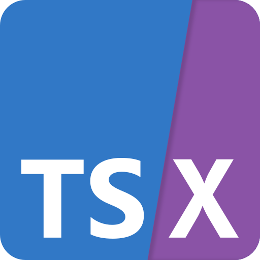
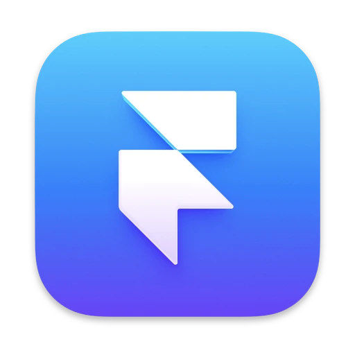
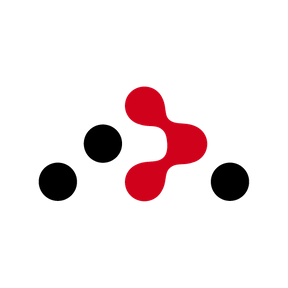
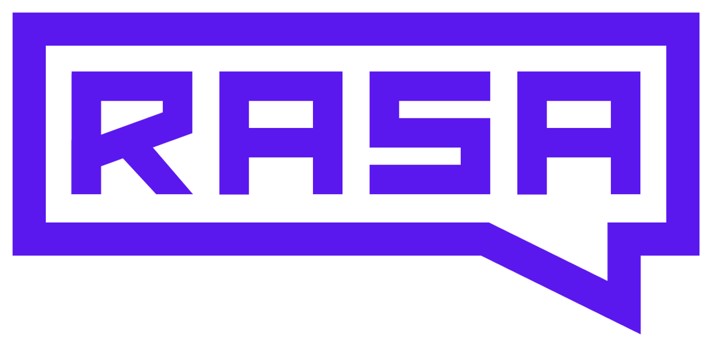

## Hello, I'm Amaan

AI & ML Engineer passionate about building intelligent systems and full-stack applications. Currently pursuing my Bachelor's degree in Artificial Intelligence & Machine Learning at Adichunchanagiri Institute of Technology with a CGPA of 8.83. I specialize in RAG pipelines, knowledge graphs, transformers, and LLM integrations.

### About Me

- **Current Role**: AI Research Associate at Keywords Studios
- **Focus**: Building scalable AI/ML solutions with emphasis on production-grade systems
- **Expertise**: Full-stack development, machine learning operations (MLOps), agentic AI, and knowledge graph embeddings
- **Passionate About**: Solving real-world problems through AI, creating intuitive user experiences, and continuous learning
- **Location**: Bengaluru, Karnataka, India
- **Open To**: Master's programs in AI/Data Science and challenging technical roles

---

## Featured Projects

---

## Technical Skills

### Programming Languages

### AI & Machine Learning

### Frontend Development

### Backend & Databases

### Tools & Platforms

---

## Experience Highlights

**AI Research Associate** | Keywords Studios (Jul 2025 - Present)
- Specializing in AGI training and agentic AI development
- Building advanced AI systems for production environments

**Executive Director** | Automatech (Apr 2025 - Present)
- Leading project planning and team management
- Driving technical innovation and product development

**ML Development Intern** | Kreat Innovations Ltd (Apr 2025 - Jul 2025)
- Developed agentic AI solutions and knowledge graph embeddings
- Implemented RAG pipelines for intelligent systems

**Technical Trainer** | Webvinyasa Tech Solutions (Dec 2023 - Mar 2025)
- Trained 100+ students in MERN stack and web development
- Mentored aspiring developers on full-stack applications

---

## Certifications & Achievements

- **React - The Complete Guide** | Academind, Udemy
- **Generative AI Unleashed** | Learnsector LLP, Udemy
- **Full Stack Data Science & ML** | Akhil Vydyula, Udemy
- **National Level Hackathon Winner** | 2nd Place, Hack Overflow - KLEIT (2023)
- **CSS Battle Winner** | 2nd Prize, BGS College of Engineering (2023)
- **Academic Excellence** | 4th Sem Merit Award, AIT Chikkamagaluru

---

## Languages

- **English**: Professional working proficiency (IELTS Band 6)
- **German**: Elementary proficiency (A1-A2)
- **Urdu, Hindi, Kannada, Malayalam**: Native/Fluent

---

## Connect With Me

I'm always open to collaborating on exciting projects, discussing AI/ML innovations, or exploring new opportunities. Feel free to reach out!

---

*Last updated: December 2025*

Hey there 👋

I'm an Full Stack Developer with a passion for AI & ML integration, I'm currently in my third year, pursuing a BE in Artificial Intelligence & Machine Learning at Adichunchanagiri Institute of Technology. I approach problem-solving with creativity and enthusiasm.

Want to know more about me? [Check out my portfolio.](https://amk.great-site.net/)

 

## 📌 Fav Repositories

 

 
 

<!-- ## 👋 Contributions

 -->

## 💼 Skills

<!-- Markup Languages -->
<table>
  <tr>
    <td align="center">
      
      
HTML 5

    </td>
    <td align="center">
      
      
JSX

    </td>
    <td align="center">
      
      
TSX

    </td>
    <td align="center">
      
      
XML

    </td>
  </tr>
</table>

<!-- Style Sheet Languages -->
<table>
  <tr>
    <td align="center">
      
      
CSS 3

    </td>
    <td align="center">
      
      
Sass

    </td>
    <td align="center">
      
      
Framer

    </td>
    <td align="center">
      
      
Bootstrap 5

    </td>
    <td align="center">
      
      
Tailwind

    </td>
  </tr>
</table>

<!-- JavaScript Frameworks -->
<table>
  <tr>
    <td align="center">
      
      
JavaScript

    </td>  
    <td align="center">
      
      
NodeJS

    </td>
    <td align="center">
      
      
ReactJS

    </td>
    <td align="center">
      
      
React Router

    </td>
    <td align="center">
      
      
Redux

    </td>
    <td align="center">
      
      
NextJS

    </td>
  </tr>
</table>

<!-- TypeScript -->
<table>
  <tr>
    <td align="center">
      
      
TypeScript

    </td>
    <!--  -->
  </tr>
</table>

<!-- Python -->
<table>
  <tr>
    <td align="center">
      
      
Python

    </td>
    <td align="center">
      
      
Flask

    </td>
    <td align="center">
      
      
Rasa

    </td>
  </tr>
</table>

<!-- Database -->
<table>
  <tr>
    <td align="center">
      
      
MySql

    </td>
    <td align="center">
      
      
MongoDB

    </td>
  </tr>
</table>

## 🍕 Social

<table>
  <tr>
    <td align="center">
      
        
LinkedIn

    </td>
    <td align="center">
      
        
Discord

    </td>
    <td align="center">
      
        
Leetcode

    </td>
    <td align="center">
      
        
Instagram

    </td>
  </tr>
</table>
